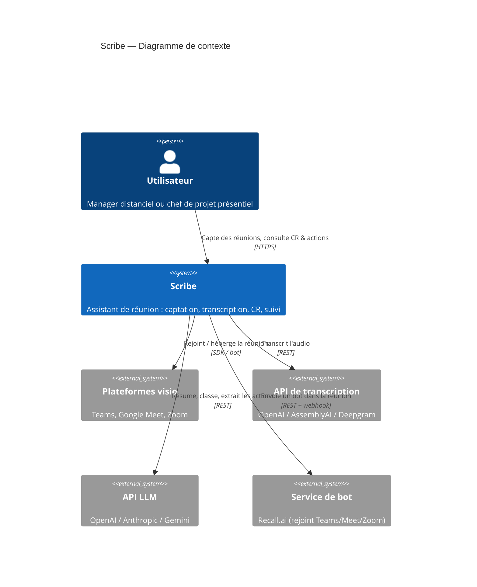
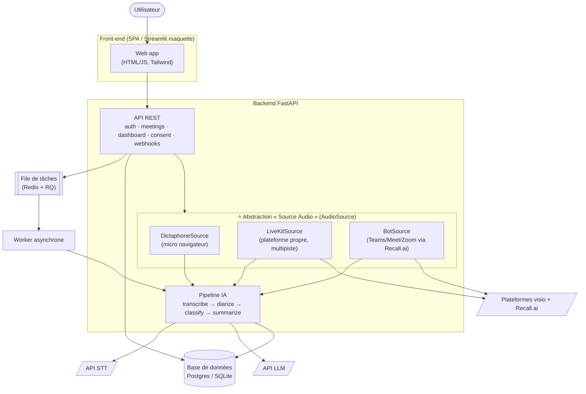
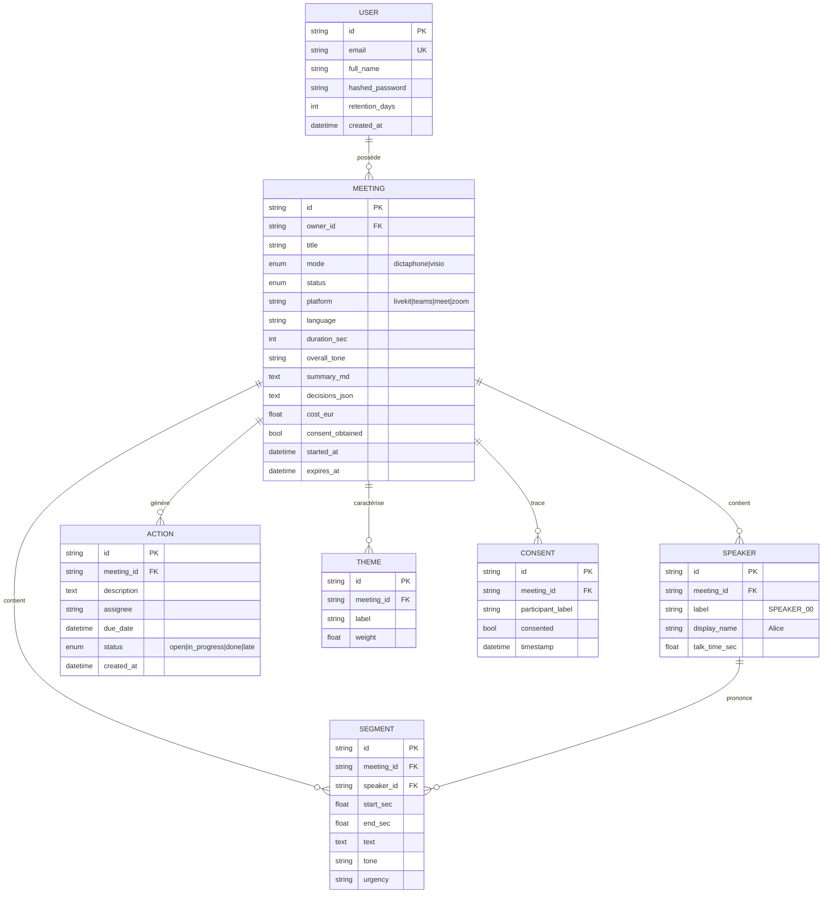
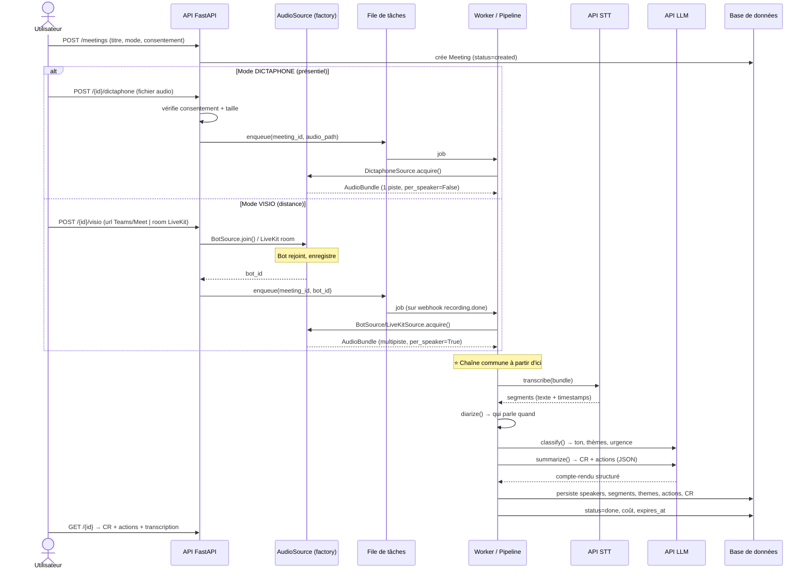
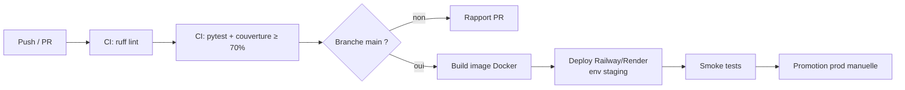

# Scribe — Spécifications & architecture

> Version 1.0 — pré-production · Bloc BC01 (conception) / BC02 (choix d'outils)

Les diagrammes sont en **Mermaid** (rendus par GitHub/VS Code) ; les sources PlantUML équivalentes sont dans `docs/diagrams/`.

---

## 1. Architecture C4

### 1.1 Niveau 1 — Contexte



### 1.2 Niveau 2 — Conteneurs

L'**abstraction « source audio »** apparaît explicitement : elle découple totalement les deux modes de captation de la chaîne de traitement.



**Conteneurs** : Front-end SPA · API FastAPI · Worker · Redis · Base de données. Le **module `audio_source`** (factory + 3 implémentations) est le point de variation unique entre visio et dictaphone — tout le reste du pipeline est commun.

---

## 2. Modèle de données

### 2.1 ERD



### 2.2 Dictionnaire d'attributs (extrait)

| Entité | Attribut | Type | Contraintes | Description |
|---|---|---|---|---|
| User | email | string | unique, indexé | Identifiant de connexion |
| User | retention_days | int | défaut 90 | Durée de conservation RGPD (configurable) |
| Meeting | mode | enum | `dictaphone`\|`visio` | Mode de captation |
| Meeting | status | enum | cf. cycle de vie | Étape dans le pipeline |
| Meeting | platform | string | nullable | Plateforme visio le cas échéant |
| Meeting | cost_eur | float | ≥ 0 | Coût API réel observé (suivi budget) |
| Meeting | consent_obtained | bool | défaut false | Verrou de traitement RGPD |
| Meeting | expires_at | datetime | nullable | Date d'effacement automatique |
| Speaker | label | string | — | Étiquette technique de diarisation |
| Speaker | display_name | string | nullable | Nom humain (identification nominative) |
| Segment | start_sec/end_sec | float | end ≥ start | Bornes temporelles |
| Segment | tone/urgency | string | nullable | Classification par segment (cible) |
| Action | assignee | string | nullable | Responsable (réf. Speaker.display_name) |
| Action | due_date | datetime | nullable | Échéance |
| Theme | weight | float | 0–1 | Importance relative |

### 2.3 Schéma JSON d'une réunion stockée

```json
{
  "id": "uuid",
  "title": "Point hebdo produit",
  "mode": "visio",
  "platform": "teams",
  "language": "fr",
  "duration_sec": 1920,
  "overall_tone": "neutre",
  "cost_eur": 0.11,
  "speakers": [
    {"label": "Alice", "display_name": "Alice", "talk_time_sec": 126.0}
  ],
  "segments": [
    {"speaker": "Alice", "start_sec": 0.0, "end_sec": 8.2,
     "text": "Bonjour à tous…", "tone": "positif", "urgency": "normale"}
  ],
  "themes": [{"label": "Livraison / planning", "weight": 0.8}],
  "decisions": ["Mise en production repoussée à lundi"],
  "actions": [
    {"description": "Livrer le correctif paiement", "assignee": "Bob",
     "due_date": "2026-06-26", "status": "open"}
  ]
}
```

---

## 3. Séquence clé — traitement complet d'une réunion

Distingue le **chemin visio** et le **chemin dictaphone**, convergeant vers la chaîne commune.



---

## 4. Choix d'API (argumenté, par famille & par palier)

| Famille | Socle 🟢 | Cible 🔵 | Avancé 🟣 | Justification |
|---|---|---|---|---|
| **Visio** | LiveKit (audio global) | LiveKit Egress **multipiste** | **Recall.ai** (Teams/Meet/Zoom) + Jitsi self-host | LiveKit = open-source, self-host UE, multipiste natif. Recall = 1 intégration pour 3 plateformes. Twilio Video **écarté (EOL)**. |
| **STT** | OpenAI gpt-4o-transcribe | + Deepgram Nova-3 (diar. native) | Whisper+pyannote **self-host** (souveraineté) | gpt-4o-transcribe : simple, 0,34 €/h, multilingue. Deepgram : diarisation native pas chère. Self-host : RGPD/coût au volume. |
| **LLM** | GPT-4o-mini | GPT-4o-mini + JSON strict | Claude Haiku en repli | Meilleur rapport qualité/prix (0,15/0,60 $/1M), JSON natif, bon en FR. |
| **Classification** | LLM (même appel) | LLM par segment | CamemBERT fine-tuné + comparaison | Démarrer sans infra ; comparer LLM vs modèle dédié au palier avancé. |

Détails chiffrés et sensibilité au volume : **[`03_benchmark.md`](03_benchmark.md)**.

---

## 5. Exigences fonctionnelles & non-fonctionnelles

| Catégorie | Exigence | Cible |
|---|---|---|
| **Performance** | Délai de traitement | ≤ 0,5× temps réel (réunion 30 min traitée < 15 min) |
| **SLO disponibilité** | Uptime API | ≥ 99,5 % |
| **SLO latence** | p95 endpoints synchrones | < 400 ms |
| **Budget API** | Coût / réunion 30 min | ≤ 0,30 € |
| **Budget pré-prod** | Plafond total essais | ≤ 15 € (audios test 5–10 min) |
| **Durée max testée** | Réunion | 90 min (garde-fou) |
| **Taille upload** | Fichier audio | ≤ 200 Mo |
| **Sécurité** | Auth | JWT, mots de passe hachés (bcrypt) |
| **Scalabilité** | Réunions simultanées | worker + queue horizontalement scalable |
| **Conformité** | Consentement | bloquant + tracé ; rétention configurable |

---

## 6. Justification technologique personnelle

### Stack & bibliothèques Python

| Choix | Alternative écartée | Raison |
|---|---|---|
| **FastAPI** | Flask, Django | Async natif, OpenAPI auto, typage Pydantic, idéal pour I/O API |
| **SQLModel** | SQLAlchemy seul | Modèles + schémas unifiés, typés, ergonomiques |
| **Pydantic v2** | dataclasses | Validation et (dé)sérialisation robustes |
| **RQ + Redis** | Celery | Plus simple, suffisant ; Celery surdimensionné au stade actuel |
| **httpx** | requests | Support async + timeouts fins |
| **passlib/bcrypt + python-jose** | — | Standards éprouvés pour auth |
| **pytest + respx** | unittest | Fixtures puissantes, mock HTTP propre |
| **ruff** | flake8 + isort + black | Tout-en-un rapide (lint PEP 8 + imports) |

### Pipeline CI/CD envisagé



- **Socle** : déploiement manuel reproductible (Docker/README), app en ligne.
- **Cible** : CI (lint+tests sur PR), déploiement semi-auto (Railway/Render/Vercel).
- **Avancé** : CD complet, environnements séparés (dev/staging/prod), monitoring, logs, alerting.

### Monitoring envisagé

- **Logs structurés** (JSON) + corrélation par `meeting_id`.
- **Métriques** : latence pipeline par étape, coût API par réunion, taux d'échec, profondeur de queue.
- **Alerting** : actions en retard, échecs de pipeline, dépassement de budget API.
- Outils candidats : Prometheus + Grafana (self-host) ou Sentry + provider PaaS.

---

*Fin des spécifications. Annexes : `03_benchmark.md`, `04_rgpd.md`, `benchmark/benchmark.xlsx`.*
