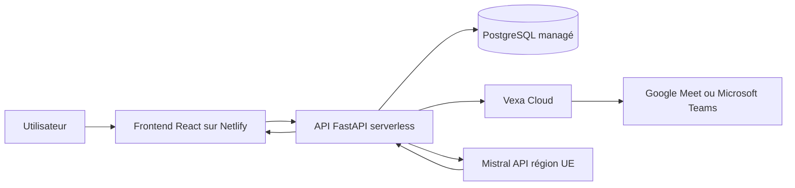

# Architecture Sprint 2

## Vue d’ensemble

Netlify sert uniquement l’application React. Les clés, l’authentification, les
consentements, les réunions et les appels IA restent dans l’API FastAPI. Le POC
utilise Vexa Cloud ; une production avec exigence de localisation doit pointer
`VEXA_API_URL` vers une instance Vexa auto-hébergée et contractualisée.

## Parcours d’une réunion en ligne

1. L’organisateur colle le lien et renseigne les participants concernés.
2. Pour Teams, il ajoute l’identifiant numérique et le code secret de l’invitation.
3. L’API envoie un lien de consentement individuel par e-mail.
4. Tant qu’un accord manque, aucun bot n’est envoyé.
5. L’organisateur confirme l’annonce visible dans la réunion.
6. Vexa rejoint Meet ou Teams et renvoie les segments avec intervenant et horodatage.
7. Le backend relaie le WebSocket Vexa au frontend sans exposer la clé API ; une synchronisation REST sert de secours.
8. Le bot surveille la commande « STOP SCRIBE » sans conserver le chat.
9. À la fin, Mistral Medium 3.5 produit un objet JSON validé par Pydantic.
10. Le bot publie un récapitulatif et le lien Scribe dans le chat, puis quitte la réunion.
11. Scribe garde le rapport et demande la purge de la réunion temporaire chez Vexa.
12. Le navigateur lit le brief audio avec deux voix locales ; aucun fichier audio n’est créé.

Le backend utilise par défaut `https://api.eu.mistral.ai/v1`. Les modèles réellement
disponibles doivent être contrôlés sur ce point d’accès avant chaque mise en production.

## Données conservées

- compte : nom, e-mail, mot de passe hashé, accords ;
- consentement : nom, e-mail, version, dates d’acceptation ou de retrait ;
- réunion : plateforme, état, transcript, segments et rapport structuré ;
- technique : erreurs utiles et preuve de purge du fournisseur.

Le lien Teams complet et son code ne sont pas conservés. L’enregistrement audio Vexa
est désactivé. Les résultats locaux expirent selon `RESULT_RETENTION_DAYS`.

## Pourquoi cette séparation

- Vexa fournit une seule intégration pour Meet et Teams.
- FastAPI garde la logique métier et les secrets hors du navigateur.
- PostgreSQL permet plusieurs instances serverless sans fichier local partagé.
- Netlify distribue rapidement l’interface et reconstruit chaque pull request.
- Le schéma Pydantic sert de contrat unique entre Mistral, l’API et React.

Le frontend et l’API métier peuvent être serverless. Le navigateur du bot, qui reste
connecté pendant toute la réunion, est un service média persistant et ne doit pas être
présenté comme une simple fonction Netlify.
